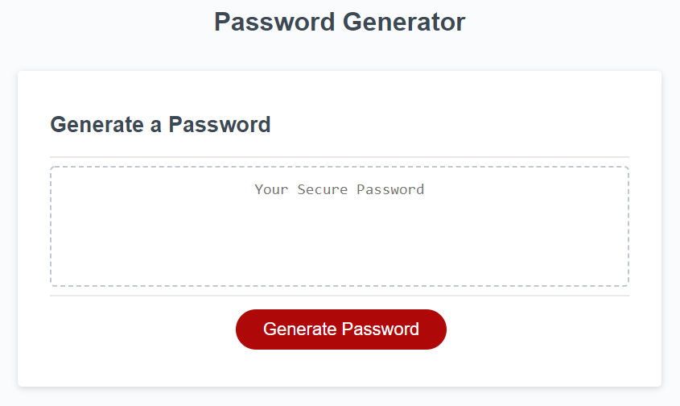

# Password-Generator

## Description

Create an application to generate a random password based on criteria that the user has selected.

Criteria for password should include:
- a password length of at least 8 characters and no more than 128 characters
- an option whether or not to include lowercase, uppercase, numeric, and/or special characters
- after all prompts are answered a password is generated and is displayed in an alert
  or written to the page 

## Usage

User can find deployed app at [GitHub](https://github.com/Babylex710/Password-Generator).

The following image shows the web application's appearance:

